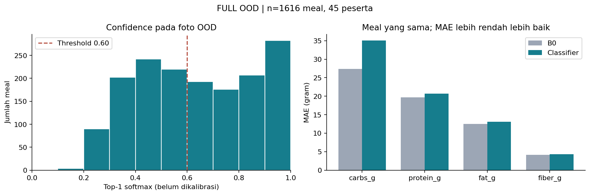

# Indonesian classifier on CGMacros — out-of-domain

Seluruh manifest dicoba. Periksa cakupan inference dan error sebelum memakai hasil.

- Run: 20260908T053051_450315Z; model: cv-baseline-v0.1; device: cpu
- Manifest penuh: 1616 meal; terpilih: 1616
- Dinilai: 1616 meal / 45 peserta
- Gagal dinilai: 0; coverage: 100.0%
- Ground-truth provenance: cgmacros_reported_estimate
- Prediction provenance: class_lookup; fiber: estimated_from_carb_ratio
- B0: carbs/protein/fat/fiber = 45/18/12/4 g, tetap
- Hash manifest penuh: 064f78df9be342da94bff2761236d0e3b5ac6da7bbd5a5aaac7c7a0109a2c152
- Hash manifest terpilih: 064f78df9be342da94bff2761236d0e3b5ac6da7bbd5a5aaac7c7a0109a2c152
- Hash checkpoint: 394c8869408025ad2cb29a3bd3e1a75d8bdc30598ec776dd75ec3db1d1bcd181
- Hash tabel makro: 57a0bb7e3e3c74f89a0f4e52d779e7bb7337a0a4e494ee1b6e556ca8bc84fb08

## Per-macro error

B0 dan classifier dinilai pada meal valid yang persis sama. Semua low_confidence tetap
masuk. Delta = MAE classifier dikurangi MAE B0; negatif berarti classifier lebih baik.

| macro | n_meals | cv_mae_g | b0_mae_g | delta_mae_g | cv_rmse_g | b0_rmse_g |
| --- | --- | --- | --- | --- | --- | --- |
| carbs_g | 1616 | 35.019 | 27.342 | 7.677 | 42.925 | 31.845 |
| protein_g | 1616 | 20.696 | 19.699 | 0.997 | 29.110 | 28.120 |
| fat_g | 1616 | 13.099 | 12.509 | 0.590 | 18.421 | 18.258 |
| fiber_g | 1616 | 4.277 | 4.178 | 0.098 | 7.918 | 7.265 |

## MAE per peserta: median [Q1, Q3]

| macro | n_participants | cv_median_[q1,q3]_g | b0_median_[q1,q3]_g | delta_median_[q1,q3]_g |
| --- | --- | --- | --- | --- |
| carbs_g | 45 | 34.718 [31.776, 38.594] | 27.057 [25.700, 29.067] | 7.945 [4.637, 11.043] |
| protein_g | 45 | 20.557 [19.239, 22.750] | 19.575 [18.318, 21.222] | 0.982 [0.372, 1.668] |
| fat_g | 45 | 13.046 [11.920, 14.379] | 12.500 [11.188, 13.412] | 0.488 [-0.096, 1.363] |
| fiber_g | 45 | 4.130 [3.458, 4.735] | 3.842 [3.600, 4.433] | 0.160 [-0.132, 0.405] |

## Confidence

- Jenis: softmax top-1 mentah, dibulatkan 4 desimal oleh predict.py
- Mean: 0.636; median: 0.622
- Q1–Q3: 0.443–0.840
- Status low_confidence (threshold 0.6): 46.9%
- Reported confidence >= 0.9: 17.5%

| lower_bound | upper_bound | n_meals | fraction |
| --- | --- | --- | --- |
| 0.000 | 0.100 | 0 | 0.000 |
| 0.100 | 0.200 | 4 | 0.002 |
| 0.200 | 0.300 | 90 | 0.056 |
| 0.300 | 0.400 | 202 | 0.125 |
| 0.400 | 0.500 | 242 | 0.150 |
| 0.500 | 0.600 | 220 | 0.136 |
| 0.600 | 0.700 | 193 | 0.119 |
| 0.700 | 0.800 | 176 | 0.109 |
| 0.800 | 0.900 | 207 | 0.128 |
| 0.900 | 1.000 | 282 | 0.175 |

## Audit

Jumlah status prediksi: {"ok": 858, "low_confidence": 758}.
Detail kegagalan disimpan lokal di audit_errors.csv dalam direktori run di data/.
Tidak ada zero-imputation atau filter berbasis confidence.
Bila coverage < 100%, tabel MAE hanya berlaku untuk subset yang berhasil; ini bukan hasil
classifier pada semua meal eligible. Error preprocessing/inference perlu ditinjau.

## Interpretasi

Pada 1616 meal dari 45 peserta (100.0% dari meal terpilih berhasil dinilai), MAE classifier lebih tinggi daripada B0 pada keempat makro. Median confidence adalah 0.622, tetapi softmax ini belum dikalibrasi dan confidence tinggi tidak membuktikan prediksi OOD benar. Angka ini menilai classifier dengan lookup/porsi tetap terhadap reported estimates CGMacros, termasuk serat heuristik, dan dipisahkan dari evaluasi utama fusion.

## Perbedaan dataset dan label prediksi

Model dilatih pada 10 kelas makanan Indonesia dari Mendeley, sedangkan
CGMacros berisi foto makanan dari domain Amerika. Makanan yang tidak termasuk
dalam 10 kelas tetap dipaksa menerima salah satu label Indonesia, sehingga
label prediksi dapat berbeda dari identitas makanan aslinya. Sebanyak
531 dari 1616 foto (32.9%) diberi label `pempek`; ini menunjukkan distribusi
prediksi, bukan 531 kesalahan klasifikasi yang telah diverifikasi secara manual.

Makro kemudian diambil dari lookup kelas tersebut dengan porsi tetap, sehingga
ketidakcocokan label dapat terbawa ke estimasi nutrisi. Eksperimen ini mengukur
performa pipeline saat digunakan pada domain berbeda; hasilnya tidak dapat
dipakai untuk menyimpulkan akurasi classifier pada makanan Indonesia.

## Batas interpretasi

Model selalu memilih satu dari 10 kelas Indonesia. Notebook tidak memiliki anotasi kelas
CGMacros yang sepadan, sehingga tidak melaporkan accuracy atau mengurangkan accuracy
Indonesia dari MAE OOD. Selisih terhadap B0 juga bukan efek kausal domain shift.
Label CGMacros merujuk consumed meal; Amount Consumed tidak dikalikan ulang.
Porsi diasumsikan tetap per kelas dan serat adalah heuristik.
Tidak ada tuning pada cohort ini. Hasil ini tidak masuk tabel utama fusion.
